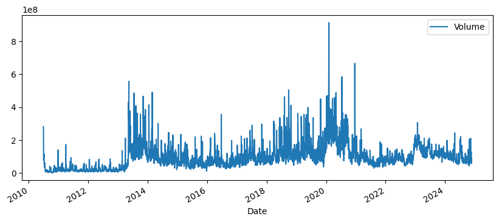
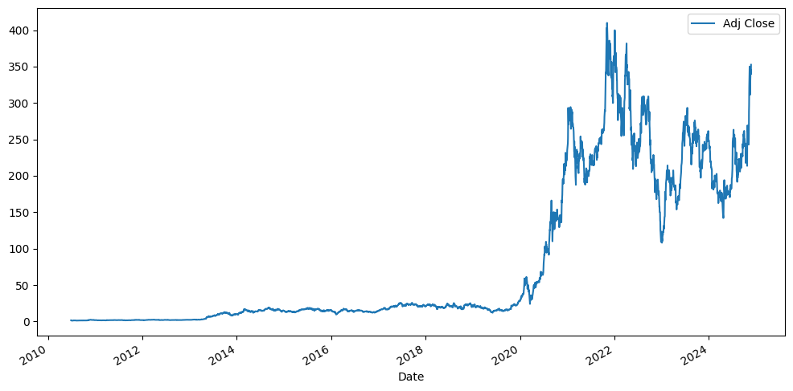
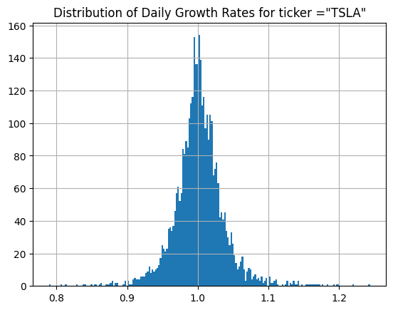

This project focuses on the analysis and prediction of Tesla stock market data. By utilizing historical stock data, it aims to uncover insights into Tesla's price movements, risks, and future behavior. The analysis combines Exploratory Data Analysis (EDA), data visualization, and predictive modeling techniques.

Key Questions Addressed:
* How has Tesla's stock price changed over time?
* What are the average daily returns, and how volatile are they?

## DataSet
The dataset is feteched from yfinance library. The columns include:
* Date (Index):The trading date (set as the index in the DataFrame).Each row corresponds to a single day's data.
* Open:The stock price at the start of the trading day.
* High:The highest stock price reached during the trading day.
* Low:The lowest stock price reached during the trading day.
* Close:The stock price at the end of the trading day.
* Adj Close (Adjusted Close):The closing price adjusted for corporate actions like stock splits, dividends, or rights offerings.It reflects the true value considering adjustments.
* Volume:The number of shares traded during the day. It is Used to gauge market activity and sentiment.

## Analysis

We first look at the total volume of stock being traded each day over the years

Now let look at the closing prices over the years:

We now look at the Growth distribution:

