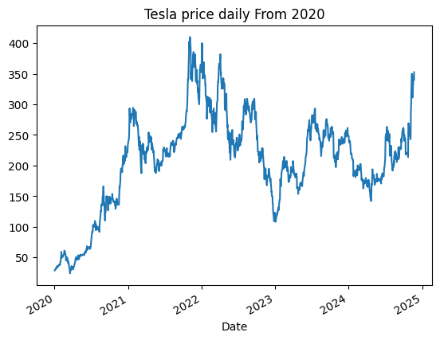
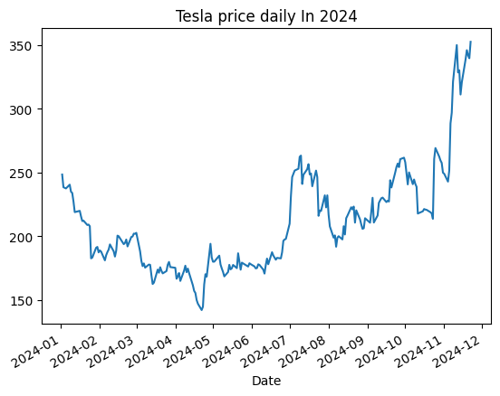
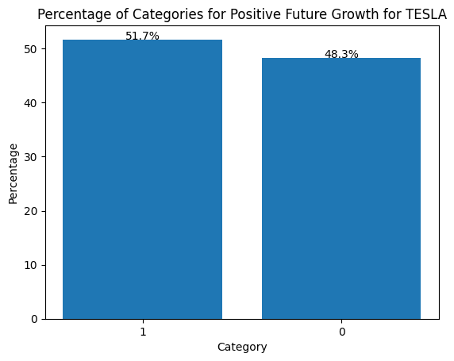
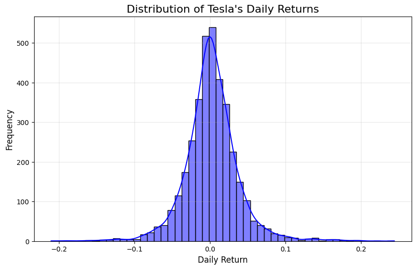
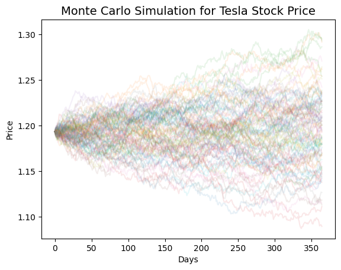
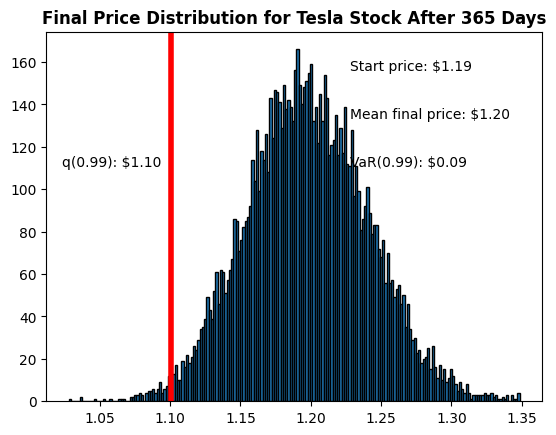

## Tesla Stock Analysis
This project explores the historical performance and trends of Tesla (TSLA) stock using data retrieved from Yahoo Finance. It includes a range of visualizations, statistical analyses, feature engineering to understand Tesla's stock behavior over time and price prediction using Monte Carlo Simulation. The analysis provides insights into price movements, daily growth rates, and the likelihood of future price changes.

## DataSet
The dataset is feteched from yfinance library. The columns include:
* Date (Index):The trading date (set as the index in the DataFrame).Each row corresponds to a single day's data.
* Open:The stock price at the start of the trading day.
* High:The highest stock price reached during the trading day.
* Low:The lowest stock price reached during the trading day.
* Close:The stock price at the end of the trading day.
* Adj Close (Adjusted Close):The closing price adjusted for corporate actions like stock splits, dividends, or rights offerings.It reflects the true value considering adjustments.
* Volume:The number of shares traded during the day. It is Used to gauge market activity and sentiment.

## Analysis

We first look at the total volume of stock being traded each day over the years

There are noticeable spikes in trading activity, especially around 2020, possibly due to significant market events like Tesla's inclusion in the S&P 500 or stock splits.
Around 2010-2013 the Trading volume was relatively low, reflecting Tesla's initial years as a publicly traded company when it was less known.
 In 2013-2019 there is a Gradual increases in volume likely correspond to Tesla gaining traction as a major player in the automotive and tech industries.

Now let look at the closing prices over the years:

The chart shows the adjusted closing price of Tesla stock over time, starting from around 2010 .
For nearly a decade, Tesla's stock price showed relatively modest growth. This phase reflects Tesla's early-stage operations and the challenges of scaling an electric vehicle (EV) business. The adjusted closing prices started to increase as from 2020
Now, Let take a look at the closing prices as from 2020:

From the graph, we cans wee that from 2020, Tesla's adjusted closing prices started to increase. This likely due to:
* Increasing EV adoption.
* Tesla's profitability milestones (e.g., multiple quarters of profit).
* Inclusion in the S&P 500 Index.
The sharp increase suggests significant speculative interest.

Also, there is a High Volatility as from 2022-2024.After reaching peak values, the stock experienced periods of sharp declines and recoveries.

Now, Let take  a closer look at the closing prices in 2024:

In 2024, the prices started by declining, at around July they started to increase, but then the trend declined again for about 3 months. In November, the prices started to increase which is the month elections were held.

We now look at the the distribution of Tesla's daily growth rates, calculated as the ratio of the adjusted close price for one day to the previous day (Adj Close[t] / Adj Close[t-1]). Here's a histogram displating the distribution:

* Most daily growth rates cluster tightly around 1.0, meaning Tesla's stock price typically experiences small day-to-day changes.This is common for stocks, where large daily price swings are relatively rare under normal market conditions.
* The majority of daily growth rates fall within the range of 0.9 to 1.1 (±10%), highlighting that Tesla's stock rarely moves drastically in a single day.
* There are occasional extreme growth rates (<0.8 or >1.2), indicating significant price changes, likely caused by major events such as earnings announcements, news, or market-wide movements.
* This analysis show that Tesla's daily price changes are generally stable, with occasional significant fluctuations. The histogram effectively summarizes Tesla's historical volatility and provides insights into its day-to-day behavior. Would you like help interpreting the 30-day growth or applying this for predictive modeling?

Now let look at whether the stock price is expected to increase (labeled as 1) or decrease (labeled as 0) compared to the current day's price.

The histogram shows that:
* The stock's price increased in 51.7% of the days (positive future growth).
* The stock's price decreased in 48.3% of the days (negative future growth).

The percentage of days with positive growth slightly exceeds those with negative growth. This suggests that, historically, Tesla's stock price is marginally more likely to increase on any given day.
The near-equal distribution implies that Tesla's stock exhibits short-term volatility with no strong skew towards consistent gains or losses over a single day.

## Risk Analysis
We will quantify risk using daily percentage returns by comparing the expected return with the standard deviation of the daily returns.
We defined a value at risk parameter for our stocks and then treat value at risk as the amount of money we could expect to lose (aka putting at risk) for a given confidence interval.WE will estimate the Value at risk using the "bootstrap" method. For this method we calculated the empirical quantiles from a histogram of daily returns.

The graph below shows the distribution of daily returns:

WE then use quantile to get the risk value for the stock and found that the 0.05 empirical quantile of daily returns is at 1.688066792488098
Whihc means that in 5% of the trading days, Tesla’s return was worse than or equal to 1.688%. If we have a 1 million dollar investment, our one-day 5% VaR is 1.688066792488098 * 1,000,000 = $16,880.67\
on the worst 5% of days, we could lose $16,880.67 or more due to the daily volatility of Tesla's stock

## Value at Risk using the Monte Carlo method
We used Monte Carlo to run many trials with random market conditions, then calculated portfolio losses for each trial. After this, we used the aggregation of all these simulations to establish how risky the stock is.

Stock prices follow a Markov process (random walk) consistent with the weak form of the Efficient Market Hypothesis (EMH), where future prices are independent of past movements.
This means that the stock price follows a random walk and is consistent with (at the very least) the weak form of the efficient market hypothesis (EMH) - past price information is already incorporated and the next price movement is "conditionally independent" of past price movements.

This means that the past information on the price of a stock is independent of where the stock price will be in the future, basically meaning, you can't perfectly predict the future solely based on the previous price of a stock.

The equation for geometric Browninan motion is given by the following equation: GBM Equation
dS=μSdt+σSdϵ
Where, S is the stock price, μ is the expected return (which we calculated earlier), σ is the standard deviation of the returns, t is time, and ϵ is the random variable.
The change in the stock price is the current stock price multiplied by two terms. The first term is known as "drift", which is the average daily return multiplied by the change of time. The second term is known as "shock", for each time period the stock will "drift" and then experience a "shock" which will randomly push the stock price up or down. By simulating this series of steps of drift and shock thousands of times, we can begin to do a simulation of where we might expect the stock price to be. This is simply a way of scaling the standard deviation

For more info on the Monte Carlo method for stocks, check out the following link: [How to use Monte Carlo simulation with GBM](https://www.investopedia.com/articles/07/montecarlo.asp)

Secondly, to demonstrate a basic Monte Carlo method, we will start with just a few simulations. First we'll define the variables we'll be using.

We create a histogram of the end results for a much larger run.

The histogram shows the distribution of final stock prices across all simulation runs. The prices are mostly clustered between 1.05 and 1.25, with a peak around 1.15–1.20. This suggests that the stock has a high probability of remaining close to its starting price, with some potential upside (beyond 1.25) and a small chance of downside (below 1.05).
Now we have looked at the 1% empirical quantile of the final price distribution to estimate the Value at Risk for the tesla stock, which looks to be 0.09 dollar for every investment of 1.19 dollar (the price of one inital Tesla stock).

This means for every initial stock you purchase, you are putting about $ 0.09 at risk 99% of the time from our Monte Carlo Simulation.